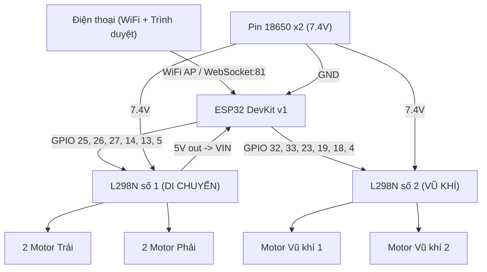

# Robot Sumo Battle Controller

> Hệ thống điều khiển robot sumo 4WD qua WiFi bằng joystick ảo trên điện thoại.
> Thiết kế cho cuộc thi **Lê Lợi Robotics Challenge 2026** — 7 đội, thi đấu 1v1.
>
> *Designed by Anh Tuan Le | VEX Technology Solutions*

---

## Giới thiệu

Dự án cung cấp mã nguồn mở (open-source) cho hệ thống robot sumo điều khiển từ xa qua WiFi, được phát triển bởi **VEX Technology Solutions** — đơn vị bảo trợ chuyên môn của giải đấu **Lê Lợi Robotics Challenge 2026**.

Mỗi đội thi sẽ được cung cấp 1 bộ kit phần cứng và sử dụng mã nguồn này để lập trình, tùy chỉnh chiến thuật cho robot của mình.

---

## Về VEX Technology Solutions

**VEX Technology Solutions** là đơn vị bảo trợ chuyên môn cho giải đấu **Lê Lợi Robotics Challenge 2026**.

VEX TECHNOLOGY SOLUTIONS là doanh nghiệp hoạt động trong lĩnh vực công nghệ, tập trung phát triển phần mềm và xây dựng các giải pháp chuyển đổi số nhằm tối ưu hoá vận hành và nâng cao hiệu quả cho doanh nghiệp. Được xây dựng bởi đội ngũ trẻ, năng động với nền tảng kỹ thuật vững chắc, VEX không ngừng nghiên cứu, phát triển và triển khai các sản phẩm có tính ứng dụng cao, linh hoạt và dễ mở rộng theo nhu cầu thực tế. Bên cạnh đó, công ty hướng tới việc xây dựng một hệ sinh thái công nghệ hiện đại, nơi các giải pháp được kết nối và tối ưu một cách toàn diện. Với định hướng phát triển bền vững, VEX không chỉ chú trọng vào chất lượng sản phẩm mà còn đề cao môi trường làm việc sáng tạo, chủ động và liên tục đổi mới, tạo điều kiện để mỗi cá nhân phát triển năng lực và đóng góp giá trị lâu dài.

Trong khuôn khổ giải đấu, VEX Technology Solutions chịu trách nhiệm:

- Thiết kế bộ kit phần cứng và phần mềm điều khiển robot
- Xây dựng tài liệu kỹ thuật và hướng dẫn cho các đội thi
- Hỗ trợ kỹ thuật trong suốt quá trình luyện tập và thi đấu
- Đảm bảo hệ thống WiFi hoạt động ổn định, không nhiễu giữa các robot

### Liên hệ

| Kênh | Thông tin |
|------|-----------|
| Email | [contact.vextech@gmail.com](mailto:contact.vextech@gmail.com) |
| Facebook | [VEX Technology Solutions](https://www.facebook.com/vex.technology.solutions) |
| Zalo OA | [VEX Technology Solutions](https://zalo.me/12830199311181452) |
| LinkedIn | [VEX Technology Solutions](https://www.linkedin.com/company/vextechnologysolutions) |

---

## Linh kiện mỗi robot

| Linh kiện | Số lượng | Chức năng |
|-----------|----------|-----------|
| ESP32 DevKit v1 (CP2102) | 1 | Bộ não điều khiển + WiFi |
| Module L298N | 2 | 1 đ/k di chuyển, 1 đ/k vũ khí |
| Động cơ giảm tốc vàng 3-9V + bánh xe | 4 | Di chuyển |
| Động cơ vũ khí | 2 | Tùy chọn cho vũ khí |
| Đế pin 18650 (2 pin nối tiếp) | 1 | Nguồn 7.4V |
| Pin 18650 | 2 | Nguồn năng lượng |
| Dây nối đực-cái | ~20 sợi | Kết nối |

---

## Sơ đồ đấu nối

Để robot hoạt động ổn định, không bị chập chờn tín hiệu điều khiển hoặc hỏng hóc linh kiện, các đội thi cần thực hiện đấu nối chính xác theo hướng dẫn chi tiết dưới đây.

### 1. Hướng dẫn cấu hình Jumper trên Module L298N (Rất Quan Trọng)

Trước khi tiến hành nối dây, bạn cần thiết lập các cầu nối nhựa (Jumper) trên cả 2 module L298N:

*   **Jumper Điều khiển Tốc độ (ENA / ENB):**
    *   **Mặc định:** L298N khi mua về sẽ có 2 jumper màu đen cắm sẵn để nối chân ENA và ENB với chân 5V kế bên (để chạy hết tốc độ).
    *   **Yêu cầu:** **BẮT BUỘC THÁO** các jumper nhựa này ra trên cả 2 module L298N #1 và L298N #2. Sau đó, nối các chân điều khiển tốc độ (PWM) của ESP32 vào các chân kim (pin header) tương ứng của ENA và ENB để điều tốc động cơ bằng code.
*   **Jumper Ổn áp 5V (5V_EN):**
    *   Jumper này nằm ngay sau domino cấp nguồn (3 cổng kết nối).
    *   **Module L298N #1 (DI CHUYỂN):** **ĐỂ NGUYÊN (CẮM)** jumper này. Khi cấp nguồn 7.4V từ pin vào cổng VCC (12V) của L298N, việc cắm jumper này sẽ kích hoạt IC ổn áp LM7805 trên mạch, biến cổng 5V trên domino thành **nguồn ra 5V (5V Out)**. Ta sẽ lấy nguồn này cấp cho chân VIN của ESP32.
    *   **Module L298N #2 (VŨ KHÍ):** **ĐỂ NGUYÊN (CẮM)** jumper này để tự nuôi mạch logic bên trong nó, nhưng **TUYỆT ĐỐI KHÔNG** nối dây từ cổng 5V của L298N #2 sang ESP32 (để tránh xung đột nguồn).

---

### 2. Hướng dẫn đấu song song động cơ di chuyển (4WD)

Robot sử dụng 4 động cơ cho việc di chuyển (4WD). Chúng ta sẽ đấu song song 2 động cơ bên Trái với nhau và 2 động cơ bên Phải với nhau vào module L298N #1 (DI CHUYỂN):

1.  **Cặp Động cơ Bên Trái (OUT1 / OUT2):**
    *   Gom dây **Đỏ** của Motor Trái-Trước và Motor Trái-Sau lại làm một, xoắn chặt và đấu vào cổng **OUT1** của L298N #1.
    *   Gom dây **Đen** của Motor Trái-Trước và Motor Trái-Sau lại làm một, xoắn chặt và đấu vào cổng **OUT2** của L298N #1.
2.  **Cặp Động cơ Bên Phải (OUT3 / OUT4):**
    *   Gom dây **Đỏ** của Motor Phải-Trước và Motor Phải-Sau lại làm một, xoắn chặt và đấu vào cổng **OUT3** của L298N #1.
    *   Gom dây **Đen** của Motor Phải-Trước và Motor Phải-Sau lại làm một, xoắn chặt và đấu vào cổng **OUT4** của L298N #1.

> [!TIP]
> **Cách kiểm tra & đảo chiều động cơ:**
> Sau khi lắp ráp xong, kê robot lên giá đỡ để bánh xe không chạm đất. Khởi động và điều khiển tiến lên qua điện thoại:
> *   Nếu có bánh quay tiến, bánh quay lùi: Đảo ngược vị trí dây Đỏ - Đen của **động cơ quay sai** đó.
> *   Nếu toàn bộ một bên quay lùi: Đổi vị trí dây tại domino của bên đó (ví dụ: đổi dây ở OUT1 sang OUT2 và ngược lại).

---

### 3. Sơ đồ kết nối tín hiệu (ESP32 → L298N)

Sử dụng dây nối đực-cái để kết nối các chân điều khiển từ ESP32 sang các chân logic trên L298N.

#### ESP32 → L298N #1 (DI CHUYỂN)

| Chân ESP32 | Chân L298N #1 | Chức năng | Ghi chú |
| :--- | :--- | :--- | :--- |
| **GPIO 25** | **ENA** | Tốc độ 2 bánh Trái (PWM) | *Phải tháo jumper ENA* |
| **GPIO 26** | **IN1** | Chiều quay 2 bánh Trái (FWD) | |
| **GPIO 27** | **IN2** | Chiều quay 2 bánh Trái (REV) | |
| **GPIO 14** | **ENB** | Tốc độ 2 bánh Phải (PWM) | *Phải tháo jumper ENB* |
| **GPIO 13** | **IN3** | Chiều quay 2 bánh Phải (FWD) | |
| **GPIO 5** | **IN4** | Chiều quay 2 bánh Phải (REV) | |

#### ESP32 → L298N #2 (VŨ KHÍ)

| Chân ESP32 | Chân L298N #2 | Chức năng | Ghi chú |
| :--- | :--- | :--- | :--- |
| **GPIO 32** | **ENA** | Tốc độ Vũ khí 1 (PWM) | *Phải tháo jumper ENA* |
| **GPIO 33** | **IN1** | Hướng quay Vũ khí 1 | |
| **GPIO 23** | **IN2** | Hướng quay Vũ khí 1 | |
| **GPIO 19** | **ENB** | Tốc độ Vũ khí 2 (PWM) | *Phải tháo jumper ENB* |
| **GPIO 18** | **IN3** | Hướng quay Vũ khí 2 | |
| **GPIO 4** | **IN4** | Hướng quay Vũ khí 2 | |

---

### 4. Sơ đồ cấp nguồn & Đấu chung GND (Cực kỳ quan trọng)

Để mạch chạy ổn định, không bị nhiễu do sụt áp từ động cơ hoặc làm mất tín hiệu kết nối WiFi, bạn bắt buộc phải đấu chung GND và đi dây nguồn đúng cách.

| Điểm xuất phát | Điểm kết nối đến | Chức năng | Ghi chú |
| :--- | :--- | :--- | :--- |
| Cực (+) Pin 18650 (7.4V) | Chân **VCC (12V)** của L298N #1 | Cấp nguồn động lực di chuyển | Nên đi qua công tắc (Switch) trước khi rẽ nhánh |
| Cực (+) Pin 18650 (7.4V) | Chân **VCC (12V)** của L298N #2 | Cấp nguồn động lực vũ khí | |
| Cực (-) Pin 18650 (GND) | Chân **GND** của L298N #1 | Nguồn âm chung | Đường GND chính từ nguồn pin |
| Chân **GND** của L298N #1 | Chân **GND** của L298N #2 | GND chung giữa 2 Driver | Nối cầu dây GND |
| Chân **GND** của L298N #2 | Chân **GND** của ESP32 | GND chung Logic | Nối cầu dây GND |
| Chân **5V (OUT)** của L298N #1 | Chân **VIN (hoặc 5V)** của ESP32 | Cấp nguồn hoạt động cho ESP32 | Lấy dòng 5V sau ổn áp của Driver #1 |

> [!WARNING]
> **CẢNH BÁO AN TOÀN KHI NẠP CODE (ĐỌC KỸ):**
> Khi cắm dây cáp USB nạp code cho ESP32 từ máy tính, **BẮT BUỘC** phải:
> 1. Tắt công tắc nguồn pin 18650 của robot.
> 2. Hoặc **rút dây nối giữa chân 5V của L298N #1 và chân VIN của ESP32**.
> Nếu không thực hiện việc này, điện áp 5V từ cổng USB máy tính và 5V từ mạch L298N sẽ xông thẳng vào nhau, có nguy cơ làm **cháy nổ cổng USB của máy tính** hoặc làm hỏng board ESP32 ngay lập tức!

---

### 5. Các lỗi thường gặp khi nối dây & Cách khắc phục

*   **Lỗi 1: Động cơ kêu vo vo nhưng không quay**
    *   *Nguyên nhân:* Pin bị yếu hoặc chưa tháo jumper ENA/ENB nhưng đã đấu chân PWM từ ESP32 vào đó.
    *   *Cách sửa:* Sạc đầy pin (đảm bảo >7V). Kiểm tra lại xem đã tháo các jumper nhựa đen trên ENA/ENB chưa.
*   **Lỗi 2: ESP32 mất kết nối liên tục khi động cơ khởi động hoặc đảo chiều**
    *   *Nguyên nhân:* Nhiễu sụt áp do động cơ kéo dòng lớn, hoặc chưa đấu chung GND (Ground) giữa ESP32 và các module L298N.
    *   *Cách sửa:* Kiểm tra lại dây GND nối từ L298N sang ESP32 xem có chắc chắn không. Tránh dùng dây nối quá nhỏ, nên chọn dây có lõi đồng dày cho đường nguồn và GND.
*   **Lỗi 3: Vặn domino nhưng dây điện bị tuột ra**
    *   *Nguyên nhân:* Tuốt vỏ dây quá ngắn hoặc vặn ốc không đúng khớp kẹp.
    *   *Cách sửa:* Tuốt vỏ nhựa khoảng 6-8mm, xoắn chặt lõi đồng lại, nới lỏng ốc domino hết cỡ trước khi luồn dây sâu vào, vặn chặt lại và giật thử dây để kiểm tra độ bám.

### Sơ đồ tổng quan



---

## Cài đặt phần mềm

### 1. Cài Arduino IDE
- Tải từ: https://www.arduino.cc/en/software

### 2. Thêm ESP32 Board
1. Mở Arduino IDE → **File** → **Preferences**
2. Trong **Additional Board Manager URLs**, thêm:
   ```
   https://raw.githubusercontent.com/espressif/arduino-esp32/gh-pages/package_esp32_index.json
   ```
3. Vào **Tools** → **Board** → **Boards Manager**
4. Tìm **esp32** và cài đặt (bởi Espressif Systems)

### 3. Cài thư viện WebSocket
1. Vào **Sketch** → **Include Library** → **Manage Libraries**
2. Tìm **WebSockets** bởi **Markus Sattler**
3. Nhấn **Install**

### 4. Cấu hình Board
- **Board**: ESP32 Dev Module
- **Upload Speed**: 921600
- **CPU Frequency**: 240MHz
- **Flash Size**: 4MB
- **Port**: Chọn cổng COM tương ứng

---

## Cách sử dụng

### Bước 1: Cấu hình Robot ID
Mở file `robot_sumo_controller.ino`, đổi dòng:
```cpp
#define ROBOT_ID  1  // Đổi thành 1, 2, 3, 4, 5, 6, hoặc 7
```

### Bước 2: Upload code
- Kết nối ESP32 qua USB
- Nhấn **Upload** trong Arduino IDE
- Đợi upload xong, mở **Serial Monitor** (115200 baud) để kiểm tra

### Bước 3: Kết nối điện thoại
1. Mở **Cài đặt WiFi** trên điện thoại
2. Tìm và kết nối vào mạng **SUMO_01** (hoặc SUMO_02, ...)
3. Nhập mật khẩu: **sumo2026**
4. Mở **trình duyệt** (Chrome/Safari)
5. Truy cập: **192.168.4.1**

### Bước 4: Điều khiển
- **Kéo joystick** để di chuyển robot
- **Lên/Xuống** = Tiến/Lùi
- **Trái/Phải** = Rẽ trái/phải
- **Nhấn giữ L1/R1** = Kích hoạt Vũ khí 1 / Vũ khí 2
- **Nhấn STOP** = Dừng khẩn cấp

---

## Chiến lược chống nhiễu WiFi

| Robot | SSID | Kênh WiFi | Khoảng cách kênh |
|-------|------|-----------|-------------------|
| 1 | SUMO_01 | 1 | — |
| 2 | SUMO_02 | 3 | +2 |
| 3 | SUMO_03 | 5 | +2 |
| 4 | SUMO_04 | 7 | +2 |
| 5 | SUMO_05 | 9 | +2 |
| 6 | SUMO_06 | 11 | +2 |
| 7 | SUMO_07 | 13 | +2 |

**Các biện pháp chống nhiễu:**
- Mỗi robot dùng kênh WiFi riêng, cách nhau 2 kênh
- Giảm công suất phát WiFi (15dBm thay vì 20dBm)
- Giới hạn 1 client kết nối mỗi robot
- WebSocket gửi data nhỏ (~10 bytes/message)
- Tần suất gửi 25Hz (đủ mượt, không quá tải)

---

## Xử lý sự cố

| Vấn đề | Giải pháp |
|--------|-----------|
| Không thấy WiFi SUMO_0X | Kiểm tra ESP32 có đang chạy (LED xanh nhấp nháy). Reset ESP32. |
| Kết nối WiFi nhưng không mở được trang | Đảm bảo nhập đúng **192.168.4.1**. Tắt mobile data. |
| Joystick lag/giật | Đứng gần robot hơn. Kiểm tra xem có thiết bị WiFi khác gây nhiễu. |
| Motor quay sai chiều | Đổi 2 dây motor hoặc đổi IN1/IN2 trong code. |
| Motor không quay | Kiểm tra kết nối dây, nguồn pin, jumper 5V trên L298N. |
| Robot chạy lệch | Điều chỉnh cơ khí hoặc thêm hệ số bù trong code. |

---

## Cấu trúc dự án

```
robot_sumo_controller/
├── robot_sumo_controller/
│   ├── robot_sumo_controller.ino   ← Code chính (upload lên ESP32)
│   └── web_interface.h             ← Giao diện điều khiển PS2-style
├── test_controller.html             ← Test joystick trên máy tính
├── LICENSE                          ← Giấy phép MIT
└── README.md                        ← Tài liệu hướng dẫn
```

---

## Tips thi đấu

1. **Sạc đầy pin** trước mỗi trận
2. **Test kết nối WiFi** trước khi vào sân
3. **Giữ điện thoại gần robot** (< 10m) để giảm lag
4. **Tắt mobile data** trên điện thoại khi điều khiển
5. **Dùng trình duyệt Chrome** để tương thích tốt nhất

---

## Giấy phép

Dự án được phân phối theo giấy phép [MIT License](LICENSE).

Copyright (c) 2026 Anh Tuan Le — VEX Technology Solutions
